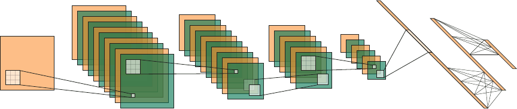

# ConvNetTikzPlot
Tool to plot the scematics of an convolutional/dense architecture of a neural network in Tikz

## Usage
 - `conv_net.tex` contains the simple architecture of the network (Input, Layers, Convolutions, Pooling, Dense)
 - `conv_net_commands.tex` contains the commands/macros to produce the Tikz elements
 - `show_network.tex` demo file to have a quick start (here the used packeges are mentioned)
 
## ToDo

Sorry, the code is still a bit messy. Even though there are no more magic numbers, the imput and the variable naming is a bit magic. 
